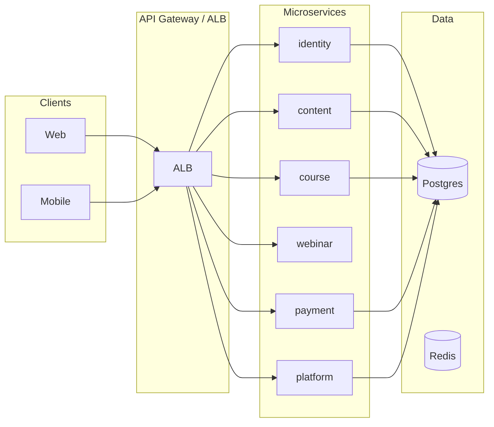

# Docfliq Backend

Monorepo backend for Docfliq: microservices (Identity, Content, Course, Webinar, Payment, Platform), shared library, Terraform infra, and CI/CD.

## Architecture

- **Services**: FastAPI apps with domain-driven layout (router → controller → service). Each service has its own DB schema and optional Redis.
- **Shared**: JWT auth, event schemas, Pydantic models, Postgres/Redis factories, middleware, utils, constants. No service-to-service imports.
- **Media**: Lambda handlers only (transcoding, image processing); no FastAPI.



## Local Development

### Prerequisites

- Python 3.11+
- Docker and Docker Compose
- Make (optional)

### Quick Start

1. Copy env and install shared + service deps:

   ```bash
   cp .env.example .env
   make install
   ```

2. Start dependencies (Postgres, Redis):

   ```bash
   make docker-up
   ```

3. Run a service (e.g. identity):

   ```bash
   make run-identity
   ```

   Or run all services via Docker Compose:

   ```bash
   docker-compose up --build
   ```

### Env Setup

Edit `.env` with your values. See `.env.example` for required variables (DB URLs, Redis, JWT secret, AWS, Razorpay, etc.).

### Make Targets

| Target           | Description                          |
|------------------|--------------------------------------|
| `make install`   | Install shared package and deps      |
| `make test`      | Run tests for all services           |
| `make lint`      | Lint with Ruff                       |
| `make run-identity` | Run identity service (and siblings) |
| `make docker-up` | Start Postgres, Redis (and optional LocalStack) |
| `make migrate`   | Run Alembic migrations (per service)|
| `make seed`      | Seed dev data                        |

## Repository Layout

- `services/identity` — MS-1: Auth, Profile, Verification, Social Graph
- `services/content` — MS-2: CMS, Feed, Search, Interactions
- `services/course` — MS-3: LMS, Assessment, Certificates
- `services/webinar` — MS-4: Live Streaming, Chime/IVS, Engagement
- `services/media` — MS-5: Lambda handlers (transcoding, image processing)
- `services/payment` — MS-6: Razorpay, Entitlements
- `services/platform` — MS-7: Admin, Notifications, Analytics, Audit
- `shared/` — JWT auth, events, models, database, middleware, utils, constants
- `infra/` — Terraform (VPC, RDS, Redis, ECS, Lambda, etc.)
- `migrations/` — Alembic per service (identity, content, course, payment, platform)
- `scripts/` — deploy, seed-data, health-check
- `.github/workflows/` — CI, deploy-dev, deploy-uat, deploy-prod

## API Versioning

All services expose routes under `/api/v1/`. Health checks at `/health`.

## Infrastructure

See `infra/` for Terraform modules and environments (dev, uat, prod). Deploy via scripts or GitHub Actions.
