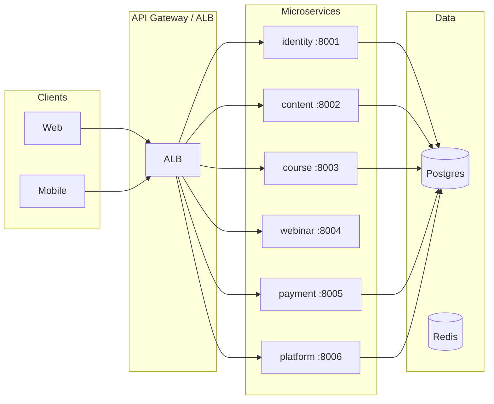

# Docfliq Backend

Monorepo backend for Docfliq: microservices (Identity, Content, Course, Webinar, Payment, Platform), shared library, Terraform infra, and CI/CD.

## Architecture

- **Services**: FastAPI apps with domain-driven layout (router → service). Each service has its own database and optional Redis.
- **Shared**: JWT auth, event schemas, Pydantic models, Postgres/Redis factories, middleware, utils, constants. No service-to-service imports.
- **Media**: Lambda handlers only (transcoding, image processing); no FastAPI.



---

## Local Development

### Prerequisites

| Tool | Version | Notes |
|------|---------|-------|
| Python | 3.12+ | `python3 --version` |
| Docker | 20+ | `docker --version` |
| make | any | `make --version` |
| jq | any | `sudo apt install jq` |

### One-time machine setup

```bash
# 1. Install python venv support (Ubuntu/Debian)
sudo apt install python3.12-venv jq -y

# 2. Create virtualenv and install all dev tools + service deps
make install-dev
make install

# 3. Install service-specific packages (uvicorn, PyJWT, etc.)
#    make install silently skips these — run explicitly:
.venv/bin/pip install -r services/content/requirements.txt

# 4. Start local Postgres + Redis (no docker-compose plugin needed)
make docker-up
```

> **Switching to AWS RDS later?**
> Get `.env.dev` from your team lead, place it in the repo root, then run `make setup-env`.
> It fetches the RDS password from Secrets Manager and writes `.env` automatically.

### Environment file

The repo ships with `.env.example`. For local dev a working `.env` is already provided:

```
POSTGRES_HOST=localhost  POSTGRES_USER=docfliq  POSTGRES_PASSWORD=changeme
```

All `DATABASE_URL`s point to local Docker Postgres by default. No AWS credentials needed for local dev.

### Make targets

| Target | Description |
|--------|-------------|
| `make venv` | Create `.venv` virtualenv |
| `make install-dev` | Install dev tools (awscli, boto3, alembic, ruff, pytest) |
| `make install` | Install all service deps + shared package |
| `make docker-up` | Start local Postgres + Redis containers |
| `make docker-down` | Stop containers (data kept) |
| `make docker-clean` | Destroy containers + data volumes (full reset) |
| `make setup-env` | Fetch RDS password from Secrets Manager → write `.env` (AWS only) |
| `make run-<service>` | Run a service locally with hot reload |
| `make migrate` | Run Alembic `upgrade head` for all services |
| `make test` | Run all service tests |
| `make lint` | Lint + format with Ruff |

---

## Microservices

### MS-1 · Identity — `services/identity` · port 8001

Auth, user profiles, verification, and social graph.

**Domains**

| Domain | Prefix | Responsibility |
|--------|--------|----------------|
| `auth/` | `/api/v1/auth` | Login (email/OTP/OAuth), JWT issue & refresh |
| `profile/` | `/api/v1/profile` | User profile CRUD, avatar upload |
| `verification/` | `/api/v1/verification` | Medical licence verification flow |
| `social_graph/` | `/api/v1/social` | Follow, block, report |

**Database**: `identity_db`

**Run**
```bash
make run-identity
# → http://localhost:8001/docs
```

---

### MS-2 · Content — `services/content` · port 8002

CMS, feed, full-text search, and all social interactions on content.

**Domains**

| Domain | Prefix | Responsibility |
|--------|--------|----------------|
| `cms/` | `/api/v1/cms` | Post + Channel create / edit / delete |
| `feed/` | `/api/v1/feed` | Paginated feed, personalized by follows & specialty |
| `search/` | `/api/v1/search` | Full-text search on posts (Postgres GIN / tsvector) |
| `interactions/` | `/api/v1/interactions` | Like, comment, bookmark, share, follow, block, report |

**Database**: `content_db`

**Schema** (10 tables)

| Table | Purpose |
|-------|---------|
| `channels` | Institutional / sponsor channels |
| `posts` | Main content posts (text, video, image, link, webinar card, course card, repost) |
| `post_versions` | Full edit history snapshots |
| `comments` | Threaded comments (depth-2) on posts |
| `likes` | Polymorphic likes on posts and comments |
| `bookmarks` | User post bookmarks |
| `shares` | Share tracking (platform: app / whatsapp / twitter / copy-link) |
| `blocks` | User block list |
| `reports` | Content and user reports |

---

#### Running the content service locally

**Step 1 — Install dependencies** (once)

```bash
# From repo root — installs uvicorn, PyJWT, asyncpg, etc.
.venv/bin/pip install -r services/content/requirements.txt
```

**Step 2 — Create the database and apply migrations** (once, or after model changes)

```bash
# Create content_db (skip if it already exists)
docker exec docfliq-postgres psql -U docfliq -c "CREATE DATABASE content_db;" 2>/dev/null || true

# Apply all migrations
cd migrations/content && ../../.venv/bin/alembic upgrade head && cd ../..

# Verify tables
docker exec docfliq-postgres psql -U docfliq -d content_db -c "\dt"
```

**Step 3 — Run the service**

```bash
make run-content
# Starts uvicorn on http://0.0.0.0:8002 with hot-reload
```

**Step 4 — Open API docs**

| URL | Description |
|-----|-------------|
| `http://localhost:8002/docs` | Swagger UI — interactive, try endpoints live |
| `http://localhost:8002/redoc` | ReDoc — read-optimised reference |
| `http://localhost:8002/health` | Liveness probe → `{"status":"ok","service":"content"}` |

---

#### Testing the API

**Generate a dev JWT token**

All write endpoints require a `Bearer` token. Generate one against the default dev secret:

```bash
python3 -c "
import jwt, datetime
print(jwt.encode(
  {'sub': 'aaaaaaaa-bbbb-cccc-dddd-eeeeeeeeeeee',
   'exp': datetime.datetime.utcnow() + datetime.timedelta(hours=24)},
  'dev-secret', algorithm='HS256'
))"
```

Copy the output. In Swagger UI click **Authorize** (top-right lock icon) and enter `Bearer <token>`.

**Quick test sequence via Swagger**

1. `GET /health` — confirm service is alive
2. `POST /api/v1/cms/channels` — create a channel
3. `POST /api/v1/cms/posts` — create a DRAFT post (`channel_id` from step 2)
4. `POST /api/v1/cms/posts/{id}/publish` — publish it
5. `GET /api/v1/feed` — confirm post appears in the public feed (no auth needed)
6. `GET /api/v1/search/posts?q=your+title` — verify full-text search
7. `POST /api/v1/interactions/posts/{id}/like` — like the post
8. `PATCH /api/v1/cms/posts/{id}` — edit post → status becomes `EDITED`, version snapshot saved
9. `GET /api/v1/cms/posts/{id}/versions` — view edit history

**curl example**

```bash
TOKEN=$(python3 -c "import jwt,datetime; print(jwt.encode(
  {'sub':'aaaaaaaa-bbbb-cccc-dddd-eeeeeeeeeeee',
   'exp':datetime.datetime.utcnow()+datetime.timedelta(hours=24)},
  'dev-secret',algorithm='HS256'))")

# Create a channel
curl -s -X POST http://localhost:8002/api/v1/cms/channels \
  -H "Authorization: Bearer $TOKEN" \
  -H "Content-Type: application/json" \
  -d '{"name":"Test Channel","description":"My first channel"}' | python3 -m json.tool

# Public feed (no auth needed)
curl -s http://localhost:8002/api/v1/feed | python3 -m json.tool
```

---

**Adding a new migration after changing models**

```bash
cd migrations/content
../../.venv/bin/alembic revision --autogenerate -m "describe_your_change"
../../.venv/bin/alembic upgrade head
cd ../..
```

---

### MS-3 · Course — `services/course` · port 8003

Complete LMS: course catalogue, enrollment, learning player with signed video URLs,
MCQ/MSQ assessments with timed quizzes, weighted progress tracking (video watch %,
document pages %, quiz pass), SCORM 1.2/2004 support, and PDF certificate generation
with QR verification.

**Domains**

| Domain | Prefix | Responsibility |
|--------|--------|----------------|
| `lms/` | `/api/v1/lms` | Course / module / lesson CRUD, enrollment (free + paid), progress tracking |
| `assessment/` | `/api/v1/assessment` | Quiz management (MCQ / MSQ), timed attempts, grading, answer review |
| `player/` | `/api/v1/player` | Video / document playback, CloudFront signed URLs, heartbeat, SCORM, weighted progress |
| `certificates/` | `/api/v1/certificates` | PDF certificate generation (ReportLab), S3 upload, public QR verification |

**Database**: `course_db`

**Schema** (12 tables)

| Table | Purpose |
|-------|---------|
| `courses` | Course catalogue with syllabus, pricing, completion_logic JSONB |
| `course_modules` | Ordered sections within a course |
| `lessons` | Individual lessons (VIDEO, PDF, TEXT, QUIZ, SCORM) with player metadata |
| `enrollments` | User enrollment with weighted progress_pct and status |
| `lesson_progress` | Per-lesson tracking: watched_intervals, pages_viewed, quiz_score |
| `quizzes` | MCQ/MSQ questions JSONB, time limits, randomize, show_answers policy |
| `quiz_attempts` | Per-attempt record with answers, score, pass/fail |
| `scorm_sessions` | SCORM 1.2/2004 runtime data (tracking_data JSONB) |
| `certificates` | PDF certificates with tamper-proof QR verification codes |

---

#### Running the course service locally

**Step 1 — Install dependencies** (once)

```bash
# From repo root
.venv/bin/pip install -r services/course/requirements.txt
```

**Step 2 — Create the database and apply migrations** (once, or after model changes)

```bash
# Create course_db (skip if it already exists)
docker exec docfliq-postgres psql -U docfliq -c "CREATE DATABASE course_db;" 2>/dev/null || true

# Apply all migrations
cd migrations/course && ../../.venv/bin/alembic upgrade head && cd ../..

# Verify tables
docker exec docfliq-postgres psql -U docfliq -d course_db -c "\dt"
```

**Step 3 — Run the service**

```bash
make run-course
# Starts uvicorn on http://0.0.0.0:8003 with hot-reload
```

**Step 4 — Open API docs**

| URL | Description |
|-----|-------------|
| `http://localhost:8003/docs` | Swagger UI — interactive, try endpoints live |
| `http://localhost:8003/redoc` | ReDoc — read-optimised reference |
| `http://localhost:8003/health` | Liveness probe → `{"status":"ok","service":"course"}` |

---

#### Testing the API

**Generate a dev JWT token**

```bash
TOKEN=$(python3 -c "import jwt,datetime; print(jwt.encode(
  {'sub':'aaaaaaaa-bbbb-cccc-dddd-eeeeeeeeeeee',
   'exp':datetime.datetime.utcnow()+datetime.timedelta(hours=24)},
  'change-me',algorithm='HS256'))")
```

> Note: the course service default JWT secret is `change-me` (see `app/config.py`).

Copy the token. In Swagger UI click **Authorize** (top-right lock icon) and enter `Bearer <token>`.

**Quick test sequence via Swagger**

1. `GET /health` — confirm service is alive
2. `POST /api/v1/lms/courses` — create a DRAFT course (instructor)
3. `POST /api/v1/lms/courses/{id}/modules` — add a module
4. `POST /api/v1/lms/modules/{id}/lessons` — add a VIDEO lesson
5. `PATCH /api/v1/lms/courses/{id}/status` — publish the course (`{"status": "PUBLISHED"}`)
6. `POST /api/v1/lms/courses/{id}/enroll` — enroll as a student
7. `POST /api/v1/assessment/lessons/{lesson_id}/quiz` — create a quiz for a lesson
8. `POST /api/v1/assessment/quizzes/{id}/start` — start the quiz (timer begins)
9. `POST /api/v1/assessment/quizzes/{id}/attempt` — submit answers
10. `GET /api/v1/player/courses/{id}/progress/detail` — view weighted progress breakdown
11. `POST /api/v1/certificates/enrollments/{id}/generate` — generate PDF certificate (after completion)
12. `GET /api/v1/certificates/verify/{code}` — public QR verification (no auth)

**curl examples**

```bash
# Create a course
curl -s -X POST http://localhost:8003/api/v1/lms/courses \
  -H "Authorization: Bearer $TOKEN" \
  -H "Content-Type: application/json" \
  -d '{
    "title": "Cardiology Basics",
    "description": "Introduction to cardiology for medical professionals.",
    "category": "Cardiology",
    "pricing_type": "FREE",
    "instructor_name": "Dr. Smith"
  }' | python3 -m json.tool

# Enroll in a course
curl -s -X POST http://localhost:8003/api/v1/lms/courses/{course_id}/enroll \
  -H "Authorization: Bearer $TOKEN" | python3 -m json.tool

# Submit a quiz attempt (MCQ answer=index, MSQ answer=[indices])
curl -s -X POST http://localhost:8003/api/v1/assessment/quizzes/{quiz_id}/attempt \
  -H "Authorization: Bearer $TOKEN" \
  -H "Content-Type: application/json" \
  -d '{"answers": [1, [0,2], 0], "time_taken_secs": 120}' | python3 -m json.tool

# Video heartbeat (anti-cheat intervals)
curl -s -X POST http://localhost:8003/api/v1/player/lessons/{lesson_id}/heartbeat \
  -H "Authorization: Bearer $TOKEN" \
  -H "Content-Type: application/json" \
  -d '{"position_secs": 180, "watched_intervals": [[0,120],[150,180]]}' | python3 -m json.tool

# Generate certificate (after course completion)
curl -s -X POST http://localhost:8003/api/v1/certificates/enrollments/{enrollment_id}/generate \
  -H "Authorization: Bearer $TOKEN" \
  -H "Content-Type: application/json" \
  -d '{"recipient_name": "Dr. Jane Smith"}' | python3 -m json.tool

# Verify certificate (public, no auth)
curl -s http://localhost:8003/api/v1/certificates/verify/{verification_code} | python3 -m json.tool
```

---

**Adding a new migration after changing models**

```bash
cd migrations/course
../../.venv/bin/alembic revision --autogenerate -m "describe_your_change"
../../.venv/bin/alembic upgrade head
cd ../..
```

---

#### Environment variables (optional overrides)

| Variable | Default | Description |
|----------|---------|-------------|
| `COURSE_DATABASE_URL` | `postgresql+asyncpg://...localhost.../course_db` | Postgres connection |
| `REDIS_URL` | `redis://localhost:6379/0` | Redis for heartbeat, resume, quiz timers |
| `JWT_SECRET` | `change-me` | JWT signing secret |
| `CLOUDFRONT_DOMAIN` | *(empty)* | CloudFront domain for signed video URLs |
| `CLOUDFRONT_KEY_PAIR_ID` | *(empty)* | CloudFront key pair ID |
| `CLOUDFRONT_PRIVATE_KEY_PATH` | *(empty)* | Path to CloudFront RSA private key |
| `S3_BUCKET` | `docfliq-media` | S3 bucket for certificate PDFs |
| `S3_REGION` | `us-east-1` | AWS region |
| `CERTIFICATE_SIGNING_SECRET` | `change-me-certificate-secret` | HMAC secret for tamper-proof codes |
| `CERTIFICATE_BASE_URL` | `https://docfliq.com/certificates` | Public verification URL prefix |

---

### MS-4 · Webinar — `services/webinar` · port 8004

Live streaming (AWS IVS / Chime), Q&A, polls.

**Domains**

| Domain | Prefix | Responsibility |
|--------|--------|----------------|
| `live_streaming/` | `/api/v1/webinar` | Webinar schedule, stream lifecycle |
| `engagement/` | `/api/v1/engagement` | Q&A, polls, reactions |

**Run**
```bash
make run-webinar
# → http://localhost:8004/docs
```

---

### MS-5 · Media — `services/media`

Lambda-only service — no FastAPI, no port.
Handles S3-triggered transcoding (video) and image processing (thumbnails, avatars).
Deploy via SAM / Terraform Lambda module.

---

### MS-6 · Payment — `services/payment` · port 8005

Razorpay integration, order management, entitlements.

**Domains**

| Domain | Prefix | Responsibility |
|--------|--------|----------------|
| `razorpay/` | `/api/v1/payment` | Order create, webhook verification |
| `entitlements/` | `/api/v1/entitlements` | Course / webinar access control |

**Database**: `payment_db`

**Run**
```bash
make run-payment
# → http://localhost:8005/docs
```

---

### MS-7 · Platform — `services/platform` · port 8006

Admin panel, notifications, analytics, audit log.

**Domains**

| Domain | Prefix | Responsibility |
|--------|--------|----------------|
| `admin/` | `/api/v1/admin` | User management, content moderation |
| `notifications/` | `/api/v1/notifications` | Push, email, SMS dispatch |
| `analytics/` | `/api/v1/analytics` | Dashboards, event aggregation |
| `audit/` | `/api/v1/audit` | Immutable audit trail |

**Database**: `platform_db`

**Run**
```bash
make run-platform
# → http://localhost:8006/docs
```

---

## Repository Layout

```
docfliq-backend/
├── services/
│   ├── identity/       # MS-1 Auth + Profile
│   ├── content/        # MS-2 CMS + Feed + Search + Interactions
│   ├── course/         # MS-3 LMS + Assessments
│   ├── webinar/        # MS-4 Live Streaming
│   ├── media/          # MS-5 Lambda handlers
│   ├── payment/        # MS-6 Razorpay + Entitlements
│   └── platform/       # MS-7 Admin + Notifications
├── shared/             # JWT, events, models, DB/Redis factories, middleware
├── migrations/
│   ├── identity/       # Alembic for identity_db
│   ├── content/        # Alembic for content_db
│   ├── course/         # Alembic for course_db
│   ├── payment/        # Alembic for payment_db
│   └── platform/       # Alembic for platform_db
├── infra/              # Terraform (VPC, RDS, ECS, Lambda, CloudFront)
├── scripts/            # setup-dev-env, deploy, seed-data, health-check
├── .env.example        # Template — copy to .env for local dev
├── .env.dev.example    # Template — copy to .env.dev for RDS/AWS access
└── Makefile
```

---

## API Versioning

All services expose routes under `/api/v1/`. Health checks at `/health`.

```bash
curl http://localhost:8002/health
# {"status": "ok", "service": "content"}
```

---

## Infrastructure

See `infra/` for Terraform modules and environment configs (`dev`, `uat`, `prod`).
Deploy via `scripts/deploy.sh` or GitHub Actions (`.github/workflows/`).
